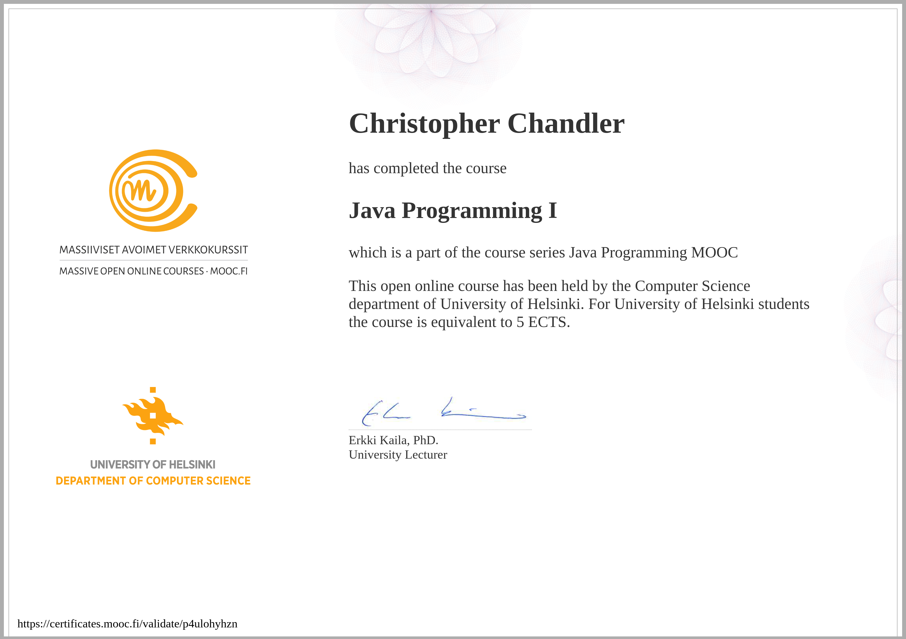

# MOOC Java Programming I
Welcome to my repository to the MOOC Java Programming I course offered by the University of Helsinki. 
This repository serves as a collection of my  solutions for the MOOC Java Programming courses, 
covering fundamental aspects of Java programming.

## Course Information

- Course name: MOOC Java Programming I
- Course provider: University of Helsinki
- Course website: [https://java-programming.mooc.fi/](https://java-programming.mooc.fi/)

## Course Content

### Part 1: Basics of Programming
1. Basics of programming
2. Conditional statements and loops
3. Arrays
4. Basic data structures

Part 1 provides a solid foundation in Java programming concepts, including control structures and data manipulation.

## Repository Contents
**mooc-java-programming-i**: Contains solutions to exercises from mooc-java-programming-i.
* Within the main directory, there are subdirectories for individual chapters and exercises, each containing my solutions.

## Certificates
As I complete the MOOC Java Programming courses, I will proudly display my certificates of completion here:

### MOOC Java Programming I

 
## Contact Information
If you have any questions, suggestions, or would like to connect with me regarding my solutions,
please don't hesitate to contact me at christopher dot chandler at outlook dot de.
Your support and collaboration are highly valued!
